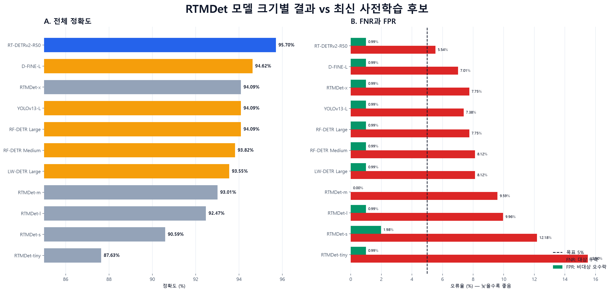
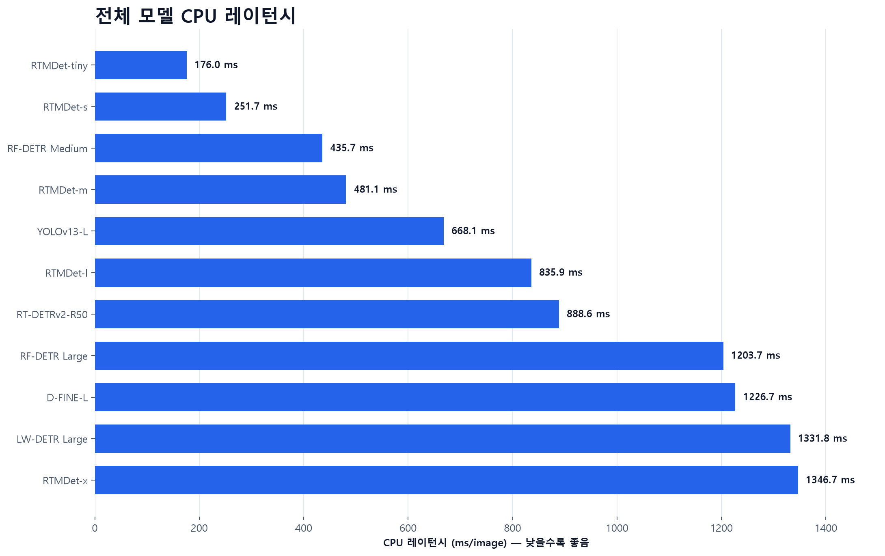
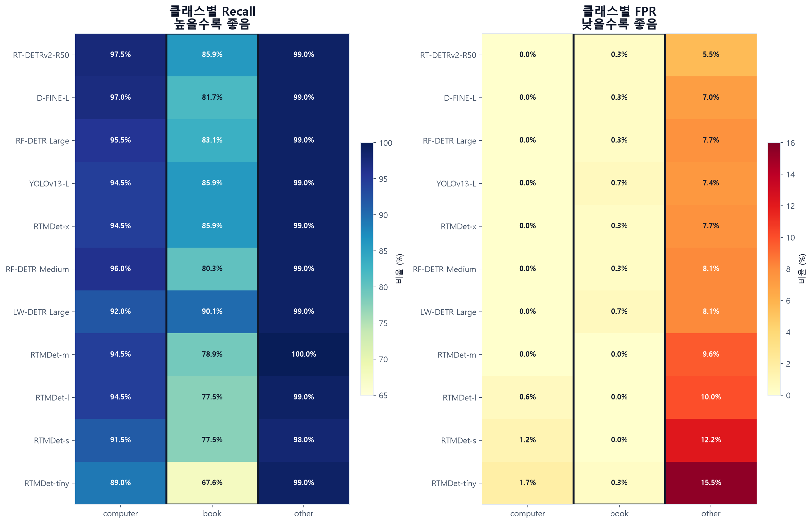
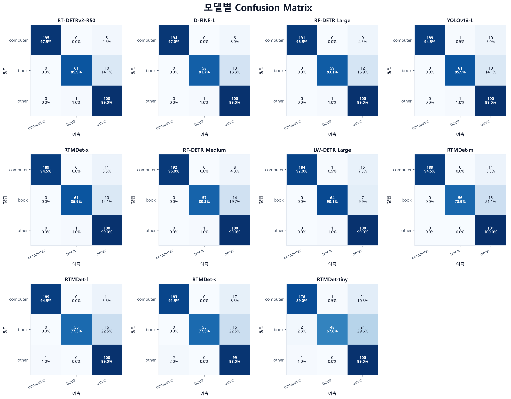

# RTMDet 모델 크기별 결과 vs 최신 탐지 모델

동일한 고유 이미지 372장에서 RTMDet 5종, 최신 후보 5종, RT-DETRv2-R50을 Top-1 기준으로 비교했습니다.

- 전체 정확도 최고값: **RT-DETRv2-R50 95.70%(356/372)**
- 최신 후보 5종 최고값: **D-FINE-L 94.62%(352/372)**
- 모든 모델의 전체 FPR은 2% 이하였지만, 전체 FNR은 5% 목표를 충족하지 못했습니다.
- 11개 모델 모두 `book` recall이 `computer` recall보다 낮았습니다.

## 전체 결과

전체 FNR은 `computer`·`book`을 `other`로 거절한 비율(분모 271), 전체 FPR은 `other`를 대상 클래스로 수락한 비율(분모 101)입니다.

| 순위 | 모델 | 구분 | 정답/372 | 정확도 | FNR | FPR | CPU 레이턴시¹ | 상업 이용 조건 |
|---:|---|---|---:|---:|---:|---:|---:|---|
| 1 | **RT-DETRv2-R50** | 기존 후보 | 356 | 95.70% | 5.54% | 0.99% | 888.6 ms | Apache-2.0 계열 |
| 2 | **D-FINE-L** | 최신 후보 | 352 | 94.62% | 7.01% | 0.99% | 1226.7 ms | Objects365 권리 확인 필요 |
| 3 | **RF-DETR Large** | 최신 후보 | 350 | 94.09% | 7.75% | 0.99% | 1203.7 ms | Apache-2.0 계열 |
| 4 | **YOLOv13-L** | 최신 후보 | 350 | 94.09% | 7.38% | 0.99% | 668.1 ms | AGPL-3.0/별도 허가 |
| 5 | **RTMDet-x** | RTMDet | 350 | 94.09% | 7.75% | 0.99% | 1346.7 ms | Apache-2.0 계열 |
| 6 | **RF-DETR Medium** | 최신 후보 | 349 | 93.82% | 8.12% | 0.99% | 435.7 ms | Apache-2.0 계열 |
| 7 | **LW-DETR Large** | 최신 후보 | 348 | 93.55% | 8.12% | 0.99% | 1331.8 ms | Objects365 권리 확인 필요 |
| 8 | **RTMDet-m** | RTMDet | 346 | 93.01% | 9.59% | 0.00% | 481.1 ms | Apache-2.0 계열 |
| 9 | **RTMDet-l** | RTMDet | 344 | 92.47% | 9.96% | 0.99% | 835.9 ms | Apache-2.0 계열 |
| 10 | **RTMDet-s** | RTMDet | 337 | 90.59% | 12.18% | 1.98% | 251.7 ms | Apache-2.0 계열 |
| 11 | **RTMDet-tiny** | RTMDet | 326 | 87.63% | 15.50% | 0.99% | 176.0 ms | Apache-2.0 계열 |

¹ 이미지 디스크 읽기와 모델 로딩을 제외한 CPU 이미지당 평균입니다. RTMDet과 신규 후보는 실행 프레임워크와 반복 횟수가 달라 모델군 사이의 속도 배수로 해석하지 않습니다.

## CPU 레이턴시

전체 11개 모델을 CPU 이미지당 평균 레이턴시가 낮은 순서로 정렬했습니다. 모델군 사이의 런타임 차이가 있으므로 참고값으로 봐야 합니다.

## 클래스별 결과

아래 FPR은 각 클래스를 one-vs-rest로 계산했습니다. 예를 들어 `book FPR`은 실제 `computer` 또는 `other` 이미지를 `book`으로 예측한 비율입니다. `other FPR`은 대상 이미지를 `other`로 예측한 비율이므로 위 전체 FNR과 같습니다.

### Book 상세

`book`은 71장입니다. 최고 recall은 LW-DETR Large의 90.14%(64/71)였으며, 전체 정확도 1위 RT-DETRv2-R50은 85.92%(61/71)였습니다.

| 모델 | 정답/71 | 누락 | Recall | Precision | FPR |
|---|---:|---:|---:|---:|---:|
| LW-DETR Large | 64 | 7 | 90.14% | 96.97% | 0.66% |
| RT-DETRv2-R50 | 61 | 10 | 85.92% | 98.39% | 0.33% |
| YOLOv13-L | 61 | 10 | 85.92% | 96.83% | 0.66% |
| RTMDet-x | 61 | 10 | 85.92% | 98.39% | 0.33% |
| RF-DETR Large | 59 | 12 | 83.10% | 98.33% | 0.33% |
| D-FINE-L | 58 | 13 | 81.69% | 98.31% | 0.33% |
| RF-DETR Medium | 57 | 14 | 80.28% | 98.28% | 0.33% |
| RTMDet-m | 56 | 15 | 78.87% | 100.00% | 0.00% |
| RTMDet-s | 55 | 16 | 77.46% | 100.00% | 0.00% |
| RTMDet-l | 55 | 16 | 77.46% | 100.00% | 0.00% |
| RTMDet-tiny | 48 | 23 | 67.61% | 97.96% | 0.33% |

### 전체 클래스 Recall·FPR

| 모델 | Computer Recall | Computer FPR | Book Recall | Book FPR | Other Recall | Other FPR |
|---|---:|---:|---:|---:|---:|---:|
| RT-DETRv2-R50 | 97.50% | 0.00% | 85.92% | 0.33% | 99.01% | 5.54% |
| D-FINE-L | 97.00% | 0.00% | 81.69% | 0.33% | 99.01% | 7.01% |
| RF-DETR Large | 95.50% | 0.00% | 83.10% | 0.33% | 99.01% | 7.75% |
| YOLOv13-L | 94.50% | 0.00% | 85.92% | 0.66% | 99.01% | 7.38% |
| RTMDet-x | 94.50% | 0.00% | 85.92% | 0.33% | 99.01% | 7.75% |
| RF-DETR Medium | 96.00% | 0.00% | 80.28% | 0.33% | 99.01% | 8.12% |
| LW-DETR Large | 92.00% | 0.00% | 90.14% | 0.66% | 99.01% | 8.12% |
| RTMDet-m | 94.50% | 0.00% | 78.87% | 0.00% | 100.00% | 9.59% |
| RTMDet-l | 94.50% | 0.58% | 77.46% | 0.00% | 99.01% | 9.96% |
| RTMDet-s | 91.50% | 1.16% | 77.46% | 0.00% | 98.02% | 12.18% |
| RTMDet-tiny | 89.00% | 1.74% | 67.61% | 0.33% | 99.01% | 15.50% |

## Confusion Matrix

각 행은 실제 클래스, 각 열은 예측 클래스입니다. 셀에는 이미지 수와 실제 클래스 내 비율을 함께 표시했습니다.

## 해석 시 주의사항

- 결과는 고유 이미지 372장(`computer` 200, `book` 71, `other` 101)의 이미지 단위 Top-1 평가입니다.
- 모델 선정에 사용한 데이터와 같은 평가 세트이므로 새로운 이미지에 대한 일반화 성능은 별도 검증이 필요합니다.
- ¹ RTMDet 5종의 지연은 같은 기존 실행 안에서 비교할 수 있습니다. 최신 후보는 프레임워크와 반복 횟수가 달라 RTMDet과의 속도 배수를 계산하지 않았습니다.
- D-FINE-L과 LW-DETR은 Objects365 관련 가중치 권리를 확인해야 합니다. YOLOv13-L은 AGPL-3.0 준수 또는 별도 허가가 필요합니다.

## 근거 자료

- [전체 클래스 수치 CSV](docs/reports/rtmdet-vs-latest/class-metrics.csv)
- [20개 모델 전체 집계](docs/reports/coco-extended-detectors/README.md)
- [통합 수치 CSV](docs/reports/coco-extended-detectors/comparison.csv)
- [평가 및 재현 방법](docs/coco-extended-detectors.md)
