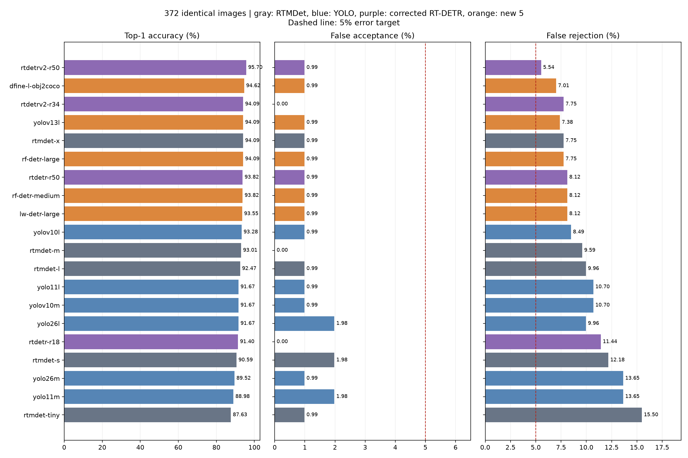

# 추가 사전학습 탐지 모델 5종 비교

추가 5종 + 기존 후보 10종 + RTMDet 기준 5종

## 평가 조건

- 드라이브 sample의 고유 이미지 372장: computer 200, book 71, other 101. RTMDet 실행의 SHA-256·정답 집합과 일치함을 검증했습니다.
- 원본 451개에서 완전 중복 79개를 제외했습니다. 추가 학습이나 평가 데이터에 맞춘 임계값 조정은 하지 않았습니다.
- COCO laptop·tv(tvmonitor 포함) → computer, book → book, 나머지 → other. 그룹별 최고 점수, Top-1, 수락 임계값 0.05, 탐지 점수 하한 0.01입니다.
- 추가 모델은 CPU 10 스레드, 배치 1, 워밍업 5회, 이미지당 1회 측정했습니다.
- 공개 가중치의 전처리를 유지했습니다: RF-DETR Large 704, Medium 576, 나머지 640. 런타임·입력 크기·반복 횟수가 다른 과거 지연 수치는 참고값입니다.
- D-FINE/LW-DETR은 Transformers로 변환된 체크포인트를 사용했습니다. 저장소 리비전과 실제 가중치 해시는 실행 결과 metrics.json에 기록했습니다.

## 기존 RT-DETR 결과 정정

기존 평가 스크립트는 PekingU 체크포인트의 COCO TV 클래스 이름 `tvmonitor`를 `other`로 잘못 매핑했습니다. `computer`로 수정한 뒤 RT-DETR 4종을 같은 372장에 재실행했습니다. 아래 전체 결과에는 수정 결과를 사용했습니다. 수정 전 원본 파일은 보존했습니다.

| 모델 | 수정 전 정답 | 수정 후 정답 | 수정 전 FPR | 수정 후 FPR | 수정 전 FNR | 수정 후 FNR |
|---|---:|---:|---:|---:|---:|---:|
| rtdetrv2-r50 | 351 | 356 | 0.99% | 0.99% | 7.38% | 5.54% |
| rtdetrv2-r34 | 344 | 350 | 0.00% | 0.00% | 9.96% | 7.75% |
| rtdetr-r50 | 347 | 349 | 0.99% | 0.99% | 8.86% | 8.12% |
| rtdetr-r18 | 328 | 340 | 0.00% | 0.00% | 15.87% | 11.44% |

## 전체 결과

정확도는 3개 라벨의 일치율입니다. FPR은 other를 대상으로 수락한 비율(분모 101), FNR은 computer·book을 other로 거절한 비율(분모 271)입니다. 대상 클래스 사이의 오분류는 정확도에 별도로 반영됩니다.

| 모델 | 구분 | 정답/372 | 정확도 | FPR | FNR | 지연 ms¹ |
|---|---|---:|---:|---:|---:|---:|
| rtdetrv2-r50 | corrected RT-DETR | 356 | 95.70% | 0.99% (1/101) | 5.54% (15/271) | 888.6 |
| dfine-l-obj2coco | new 5 | 352 | 94.62% | 0.99% (1/101) | 7.01% (19/271) | 1226.7 |
| rtdetrv2-r34 | corrected RT-DETR | 350 | 94.09% | 0.00% (0/101) | 7.75% (21/271) | 616.2 |
| yolov13l | new 5 | 350 | 94.09% | 0.99% (1/101) | 7.38% (20/271) | 668.1 |
| rtmdet-x | RTMDet reference | 350 | 94.09% | 0.99% (1/101) | 7.75% (21/271) | 1346.7 |
| rf-detr-large | new 5 | 350 | 94.09% | 0.99% (1/101) | 7.75% (21/271) | 1203.7 |
| rtdetr-r50 | corrected RT-DETR | 349 | 93.82% | 0.99% (1/101) | 8.12% (22/271) | 1355.4 |
| rf-detr-medium | new 5 | 349 | 93.82% | 0.99% (1/101) | 8.12% (22/271) | 435.7 |
| lw-detr-large | new 5 | 348 | 93.55% | 0.99% (1/101) | 8.12% (22/271) | 1331.8 |
| yolov10l | previous YOLO | 347 | 93.28% | 0.99% (1/101) | 8.49% (23/271) | 581.2 |
| rtmdet-m | RTMDet reference | 346 | 93.01% | 0.00% (0/101) | 9.59% (26/271) | 481.1 |
| rtmdet-l | RTMDet reference | 344 | 92.47% | 0.99% (1/101) | 9.96% (27/271) | 835.9 |
| yolo11l | previous YOLO | 341 | 91.67% | 0.99% (1/101) | 10.70% (29/271) | 441.3 |
| yolov10m | previous YOLO | 341 | 91.67% | 0.99% (1/101) | 10.70% (29/271) | 310.4 |
| yolo26l | previous YOLO | 341 | 91.67% | 1.98% (2/101) | 9.96% (27/271) | 397.1 |
| rtdetr-r18 | corrected RT-DETR | 340 | 91.40% | 0.00% (0/101) | 11.44% (31/271) | 760.9 |
| rtmdet-s | RTMDet reference | 337 | 90.59% | 1.98% (2/101) | 12.18% (33/271) | 251.7 |
| yolo26m | previous YOLO | 333 | 89.52% | 0.99% (1/101) | 13.65% (37/271) | 331.0 |
| yolo11m | previous YOLO | 331 | 88.98% | 1.98% (2/101) | 13.65% (37/271) | 347.0 |
| rtmdet-tiny | RTMDet reference | 326 | 87.63% | 0.99% (1/101) | 15.50% (42/271) | 176.0 |

¹ 디스크 읽기·모델 로딩 제외. 과거 실행과의 속도 배수는 계산하지 않았습니다.

## 추가 모델과 RTMDet-x의 이미지별 대조

| 추가 모델 | x의 오답을 수정 | x의 정답을 오답으로 변경 | book → other | computer → other | FPR·FNR 모두 ≤5% |
|---|---:|---:|---:|---:|---|
| dfine-l-obj2coco | 11 | 9 | 13 | 6 | 미충족 |
| yolov13l | 9 | 9 | 10 | 10 | 미충족 |
| rf-detr-large | 13 | 13 | 12 | 9 | 미충족 |
| rf-detr-medium | 11 | 12 | 14 | 8 | 미충족 |
| lw-detr-large | 11 | 13 | 7 | 15 | 미충족 |

## 상업적 이용 조건

아래는 확인한 공개 조건을 바탕으로 한 배포 검토 분류입니다. 가중치의 학습 데이터 조건과 코드 라이선스는 별도로 확인해야 합니다.

| 모델 | 코드·모델 카드 | 상업 서비스 판단 |
|---|---|---|
| RF-DETR Large·Medium | Apache-2.0 | 공개 조건상 상업 이용 가능. 라이선스·저작권 고지 및 해당 NOTICE 유지. 사용한 두 모델은 Plus/PML 모델이 아님. |
| D-FINE-L Objects365→COCO | Apache-2.0 + 가중치 조건 검토 | 제작사가 Objects365 가중치의 상업적 사용을 자동으로 허용된 것으로 보지 말라고 명시. 권리 확인 전 배포 후보 보류. |
| LW-DETR Large | Apache-2.0 + 학습 데이터 조건 검토 | Objects365 사전학습을 사용하며 데이터 사이트는 학술 목적을 명시. 모델 가중치에 대한 상업 이용 허가 범위 확인 필요. |
| YOLOv13-L | AGPL-3.0 | 상업 이용 자체는 가능하지만 배포·수정된 네트워크 서비스의 소스 제공 의무 등을 준수해야 함. 비공개 제품은 관련 권리자의 별도 허가 범위 확인 필요. |
| RTMDet·RT-DETR 기존 기준 모델 | Apache-2.0 프로젝트 | 상업 이용에 유리한 허용적 코드 라이선스. 배포 시 사용 가중치와 고지 조건 확인. |
| 기존 Ultralytics YOLO 후보 | AGPL-3.0 / 별도 Enterprise 조건 | 비공개 상업 제품은 별도 Enterprise 허가 범위 확인. 이 허가가 YOLOv13 외부 포크까지 포함한다고 가정하지 않음. |

출처: [RF-DETR 모델별 라이선스](https://github.com/roboflow/rf-detr), [D-FINE 가중치 주의사항](https://github.com/Peterande/D-FINE#model-zoo), [LW-DETR 학습 경로](https://github.com/Atten4Vis/LW-DETR), [Objects365 이용 조건](https://www.objects365.org/download.html), [YOLOv13 LICENSE](https://github.com/iMoonLab/yolov13/blob/main/LICENSE), [MMDetection LICENSE](https://github.com/open-mmlab/mmdetection/blob/main/LICENSE), [RT-DETR LICENSE](https://github.com/lyuwenyu/RT-DETR/blob/main/LICENSE), [Ultralytics 라이선스](https://www.ultralytics.com/license).

## 결론

- 현재 조건에서 상업 배포 후보 1순위는 `rtdetrv2-r50`입니다. RTMDet-x보다 6장을 더 맞혔고(356 대 350), FNR은 7.75%에서 5.54%로 낮았으며 FPR은 같은 0.99%였습니다. 43.0M 파라미터로 RTMDet-x보다 작고 Apache-2.0 계열입니다.
- 다만 목표 FNR 5%를 충족하려면 오탐 거절이 최대 13장이어야 하는데 15장으로 2장 초과했습니다. RTMDet-x와의 이미지별 정확도 차이도 exact McNemar p=0.238로, 이 372장만으로 우위를 확정할 수 없습니다.
- 새 5개 중 정확도 1위인 D-FINE-L은 352장으로 RTMDet-x보다 2장 많았지만, Objects365 사전학습 가중치의 상업 이용 권리가 불명확해 제품 후보로 바로 채택하기 어렵습니다.
- RF-DETR Large는 RTMDet-x와 동률이고 Medium은 1장 낮았습니다. YOLOv13-L은 동률이지만 AGPL-3.0 조건이 있으며, LW-DETR Large는 2장 낮고 Objects365 조건 확인이 필요합니다.

## 해석 범위

이 결과는 동일한 372장의 폴더 라벨 평가입니다. 모델 선택에 반복 사용한 데이터이므로 새로운 이미지에서의 우월성을 입증하지는 않습니다. 여러 대상이 함께 보이는 사진과 실제 서비스의 세션 판정은 별도 검증이 필요합니다.

- [전체 집계 CSV](comparison.csv)
- [기존 RT-DETR 정정 내역](corrections.csv)
- [폴더별 결과](by_source.csv)
- [RTMDet-x와 다른 예측 목록](disagreements.csv)
- [설정·라이선스·집계 JSON](comparison.json)
