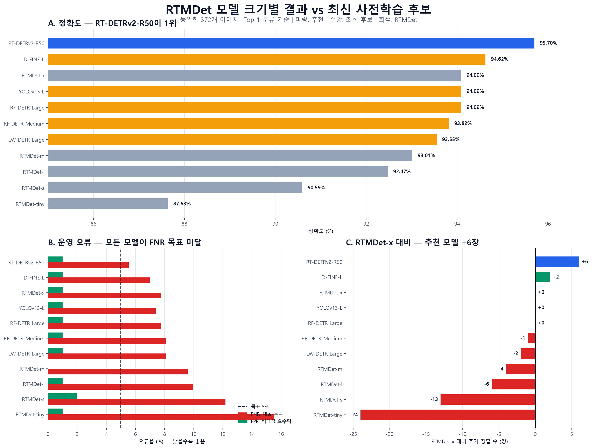
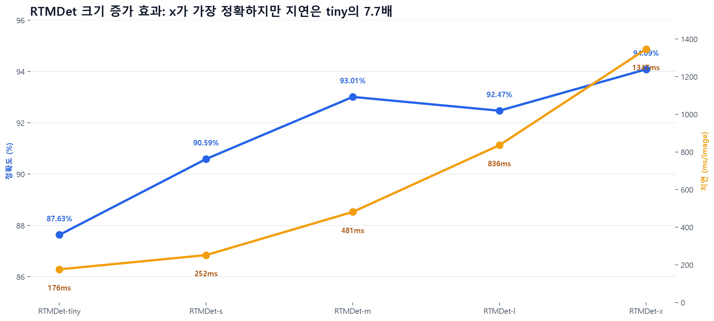

# PM 보고: RTMDet 모델 크기별 결과 vs 최신 탐지 모델

> **제안: RT-DETRv2-R50을 다음 PoC 모델로 채택하고, RTMDet-x는 기준 모델로 유지합니다.**
> 정확도는 95.70%로 RTMDet-x보다 6장을 더 맞혔지만, FNR 5% 목표와 독립 검증은 아직 통과하지 못했습니다.

## 한눈에 보는 의사결정

| 질문 | 답변 | 판단 |
|---|---|---|
| RTMDet보다 정확한 모델이 있는가? | **있음. RT-DETRv2-R50 95.70%** vs RTMDet-x 94.09% | 다음 검증 진행 |
| 개선폭은 충분한가? | **+6장, +1.61%p** | 방향은 긍정적이나 통계적으로 미확정 |
| 대상 누락이 줄었는가? | FNR **7.75% → 5.54%** | 21장 → 15장으로 개선 |
| 비대상 오수락은 늘었는가? | FPR **0.99% → 0.99%** | 동일, 각 1장 |
| 상업 적용이 가능한가? | RT-DETRv2-R50·RTMDet은 Apache-2.0 계열 | 고지 조건을 지키면 유리 |
| 바로 제품에 적용할 수 있는가? | **아직 아님** | 독립 데이터·임계값·실서비스 속도 검증 필요 |

## RTMDet 크기별 결과

RTMDet은 전반적으로 모델이 커질수록 정확도가 좋아졌지만, `m → l`에서는 정확도가 오히려 0.54%p 낮아졌습니다. 가장 정확한 `x`는 `tiny`보다 정답이 24장 많고 CPU 지연은 약 7.7배입니다.

| 모델 | 정답/372 | 정확도 | FPR | FNR | CPU 지연¹ |
|---|---:|---:|---:|---:|---:|
| RTMDet-tiny | 326 | 87.63% | 0.99% | 15.50% | 176 ms |
| RTMDet-s | 337 | 90.59% | 1.98% | 12.18% | 252 ms |
| RTMDet-m | 346 | 93.01% | 0.00% | 9.59% | 481 ms |
| RTMDet-l | 344 | 92.47% | 0.99% | 9.96% | 836 ms |
| RTMDet-x | 350 | 94.09% | 0.99% | 7.75% | 1347 ms |

## 최신 후보와 직접 비교

`최신 후보`는 이번에 추가 실행한 5개 모델입니다. RT-DETRv2-R50은 앞선 후보 평가의 클래스 매핑 오류를 보정한 결과이며, 전체 모델 중 성능이 가장 좋아 의사결정 표에 함께 넣었습니다.

| 순위 | 모델 | 구분 | 정답/372 | 정확도 | FPR | FNR | RTMDet-x 대비 | 상업 적용 검토 |
|---:|---|---|---:|---:|---:|---:|---:|---|
| 1 | **RT-DETRv2-R50** | 추천 | 356 | 95.70% | 0.99% | 5.54% | +6장 | 가능성 높음 |
| 2 | **D-FINE-L** | 최신 후보 | 352 | 94.62% | 0.99% | 7.01% | +2장 | 권리 확인 필요 |
| 3 | **RF-DETR Large** | 최신 후보 | 350 | 94.09% | 0.99% | 7.75% | +0장 | 가능성 높음 |
| 4 | **YOLOv13-L** | 최신 후보 | 350 | 94.09% | 0.99% | 7.38% | +0장 | AGPL/별도 허가 |
| 5 | **RTMDet-x** | RTMDet | 350 | 94.09% | 0.99% | 7.75% | +0장 | 가능성 높음 |
| 6 | **RF-DETR Medium** | 최신 후보 | 349 | 93.82% | 0.99% | 8.12% | -1장 | 가능성 높음 |
| 7 | **LW-DETR Large** | 최신 후보 | 348 | 93.55% | 0.99% | 8.12% | -2장 | 권리 확인 필요 |
| 8 | **RTMDet-m** | RTMDet | 346 | 93.01% | 0.00% | 9.59% | -4장 | 가능성 높음 |
| 9 | **RTMDet-l** | RTMDet | 344 | 92.47% | 0.99% | 9.96% | -6장 | 가능성 높음 |
| 10 | **RTMDet-s** | RTMDet | 337 | 90.59% | 1.98% | 12.18% | -13장 | 가능성 높음 |
| 11 | **RTMDet-tiny** | RTMDet | 326 | 87.63% | 0.99% | 15.50% | -24장 | 가능성 높음 |

## PM 권고안

### 1. RT-DETRv2-R50으로 제한된 PoC 진행

- 현재 표본에서 정확도 1위이며 RTMDet-x와 같은 FPR에서 FNR을 2.21%p 낮췄습니다.
- Apache-2.0 계열이라 폐쇄형 상업 서비스 검토가 상대적으로 단순합니다.
- 파라미터는 43.0M으로 현재 프로젝트의 `RTMDet-l보다 작은 후보` 조건을 충족합니다.

### 2. RTMDet-x는 비교 기준으로 유지

- 최신 후보 5개 중 D-FINE-L만 RTMDet-x보다 2장 더 맞혔습니다.
- RF-DETR Large와 YOLOv13-L은 동률, RF-DETR Medium과 LW-DETR Large는 더 낮았습니다.
- RTMDet-x는 라이선스가 명확하고 기존 구현이 있어 롤백 기준으로 적합합니다.

### 3. 제품 전환 전에 세 가지 게이트 적용

1. **독립 검증:** 모델 선정에 사용하지 않은 신규 이미지로 재평가합니다.
2. **운영 목표:** 검증 세트에서 FPR ≤ 5%, FNR ≤ 5%를 모두 통과해야 합니다. 현재 최선 FNR은 5.54%로 누락 2장을 더 줄여야 합니다.
3. **배포 검증:** 같은 서버·런타임·반복 횟수로 GPU 지연과 메모리를 다시 측정합니다.

## 해석 시 주의사항

- 결과는 고유 이미지 372장(`computer` 200, `book` 71, `other` 101)의 이미지 단위 Top-1 평가입니다.
- RT-DETRv2-R50과 RTMDet-x의 이미지별 차이는 exact McNemar `p=0.238`입니다. 현재 표본만으로 우위를 확정할 수 없습니다.
- ¹ RTMDet 5종의 지연은 같은 기존 실행 안에서 비교할 수 있습니다. 최신 후보는 프레임워크와 반복 횟수가 달라 RTMDet과의 속도 배수를 보고하지 않습니다.
- D-FINE-L과 LW-DETR은 Objects365 관련 가중치 권리를 확인해야 합니다. YOLOv13-L은 AGPL-3.0 준수 또는 별도 허가가 필요합니다.

## 근거 자료

- [20개 모델 전체 집계](../coco-extended-detectors/README.md)
- [통합 수치 CSV](../coco-extended-detectors/comparison.csv)
- [기존 RTMDet 크기별 원본 결과](../../../outputs/rtmdet/model-size-20260927/model-size-comparison/README.md)
- [평가 및 재현 방법](../../coco-extended-detectors.md)
