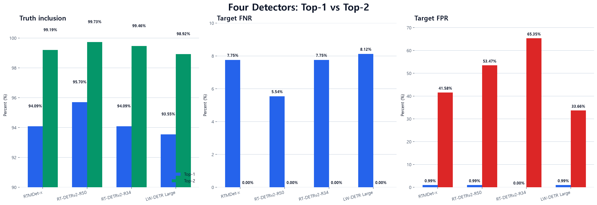
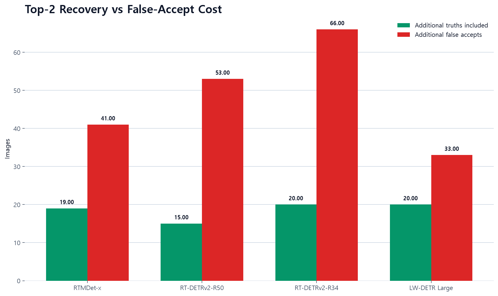
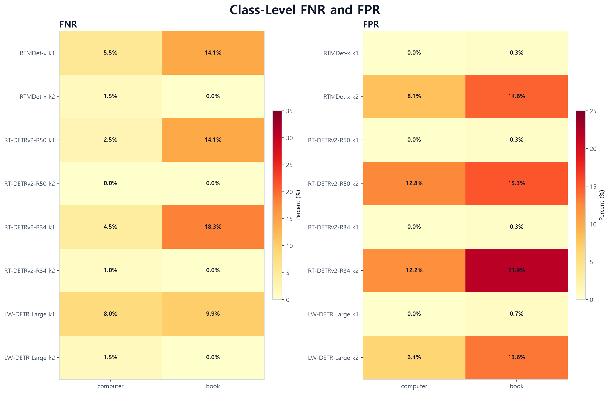
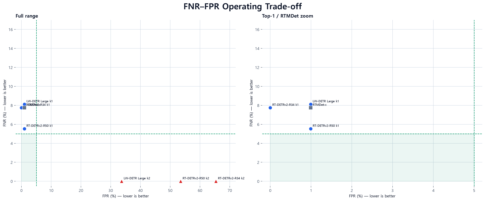
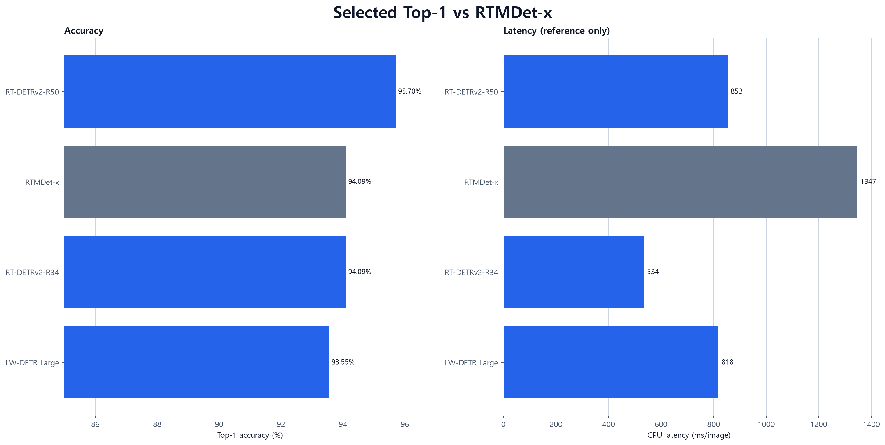

# 선택 모델 Top-1·Top-2 비교

RT-DETRv2-R50, RT-DETRv2-R34, LW-DETR Large의 동일한 추론 점수에서 Top-1과 Top-2를 비교합니다.
이 실험은 사전학습 모델의 추론 후처리 비교이며 fine-tuning이나 가중치 갱신이 아닙니다.

## 결론

- **자동 단일 판정은 RT-DETRv2-R50 Top-1이 가장 안정적**입니다: 정확도 95.70%, FNR 5.54%, FPR 0.99%.
- Top-2는 세 모델 모두 전체 FNR을 0%로 낮췄지만 FPR이 33.66~65.35%로 증가했습니다.
- Top-2 중에서는 **LW-DETR Large가 가장 낮은 FPR 33.66%**였지만 자동 승인에는 여전히 높습니다.
- 따라서 Top-2는 자동 판정보다 후속 분류기 또는 사용자 확인에 전달하는 recall 우선 shortlist로 사용하는 편이 적절합니다.

## 선택 모델 결과

전체 FNR은 대상 이미지에서 `computer` 또는 `book` 후보가 하나도 없는 비율이고, FPR은 `other` 이미지에 대상 후보가 하나 이상 포함된 비율입니다.
정답 포함률은 폴더 정답이 후보 집합 안에 존재하는 비율이므로 Top-2 단일 분류 정확도로 해석하면 안 됩니다.

| 모델 | k | 정답 포함률 | 전체 FNR | 전체 FPR | 정답 클래스 FNR | 복수 후보율 |
|---|---:|---:|---:|---:|---:|---:|
| RT-DETRv2-R50 | 1 | 95.70% | 5.54% | 0.99% | 5.54% | 0.00% |
| RT-DETRv2-R50 | 2 | 99.73% | 0.00% | 53.47% | 0.00% | 87.37% |
| RT-DETRv2-R34 | 1 | 94.09% | 7.75% | 0.00% | 8.12% | 0.00% |
| RT-DETRv2-R34 | 2 | 99.46% | 0.00% | 65.35% | 0.74% | 90.59% |
| LW-DETR Large | 1 | 93.55% | 8.12% | 0.99% | 8.49% | 0.00% |
| LW-DETR Large | 2 | 98.92% | 0.00% | 33.66% | 1.11% | 81.45% |

## Top-2 변화

| 모델 | 추가 정답 포함 | FNR 변화 | FPR 변화 |
|---|---:|---:|---:|
| RT-DETRv2-R50 | +15 | 5.54% → 0.00% | 0.99% → 53.47% |
| RT-DETRv2-R34 | +20 | 7.75% → 0.00% | 0.00% → 65.35% |
| LW-DETR Large | +20 | 8.12% → 0.00% | 0.99% → 33.66% |

## 등록 클래스별 지표

| 모델 | k | 클래스 | Precision | Recall | FNR | FPR |
|---|---:|---|---:|---:|---:|---:|
| RT-DETRv2-R50 | 1 | computer | 100.00% | 97.50% | 2.50% | 0.00% |
| RT-DETRv2-R50 | 1 | book | 98.39% | 85.92% | 14.08% | 0.33% |
| RT-DETRv2-R50 | 2 | computer | 90.09% | 100.00% | 0.00% | 12.79% |
| RT-DETRv2-R50 | 2 | book | 60.68% | 100.00% | 0.00% | 15.28% |
| RT-DETRv2-R34 | 1 | computer | 100.00% | 95.50% | 4.50% | 0.00% |
| RT-DETRv2-R34 | 1 | book | 98.31% | 81.69% | 18.31% | 0.33% |
| RT-DETRv2-R34 | 2 | computer | 90.41% | 99.00% | 1.00% | 12.21% |
| RT-DETRv2-R34 | 2 | book | 51.82% | 100.00% | 0.00% | 21.93% |
| LW-DETR Large | 1 | computer | 100.00% | 92.00% | 8.00% | 0.00% |
| LW-DETR Large | 1 | book | 96.97% | 90.14% | 9.86% | 0.66% |
| LW-DETR Large | 2 | computer | 94.71% | 98.50% | 1.50% | 6.40% |
| LW-DETR Large | 2 | book | 63.39% | 100.00% | 0.00% | 13.62% |

## FNR–FPR 트레이드오프

왼쪽은 Top-2까지 포함한 전체 범위, 오른쪽은 Top-1과 RTMDet 결과를 확대한 그림입니다. 초록색 영역은 FNR·FPR이 모두 5% 이하인 목표 구간입니다.

## RTMDet-x Top-1 기준

아래 수치는 동일한 372장에서 측정한 RTMDet-x Top-1 결과입니다. 선택 모델 실행은 같은 RTMDet 이미지 SHA-256 manifest와 일치할 때만 진행됩니다.

| 모델 | 정확도 | FNR | FPR | CPU 지연 |
|---|---:|---:|---:|---:|
| RTMDet-x | 94.09% | 7.75% | 0.99% | 1346.7 ms |

## 평가 조건

- 고유 이미지 372장: computer 200, book 71, other 101
- 그룹 임계값 0.05, 원시 탐지 하한 0.01, 입력 640 또는 체크포인트 기본 전처리
- CPU 10 threads, warm-up 5회, 이미지당 측정 1회
- 동일 이미지 manifest SHA-256을 기존 RTMDet 실행과 대조

## 해석 주의사항

- Top-2는 최대 두 후보를 반환하므로 정답 포함률과 recall은 구조적으로 상승할 수 있습니다.
- 자동 승인 정책에서는 FPR과 precision 악화 여부를 우선 확인해야 합니다.
- `정답 클래스 FNR`은 book을 computer로만 포함한 경우도 누락으로 계산하며, 전체 FNR보다 엄격한 지표입니다.
- 모델 선택에 이미 사용한 372장이므로 최종 정책과 임계값은 별도 검증 데이터에서 확정해야 합니다.

산출물: [통합 CSV](comparison-with-rtmdet.csv) · [클래스별 CSV](class-metrics.csv) · [모델별 JSON](summary.json) · 모델별 `topk-predictions.csv`
